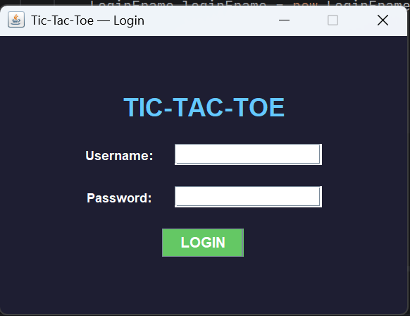
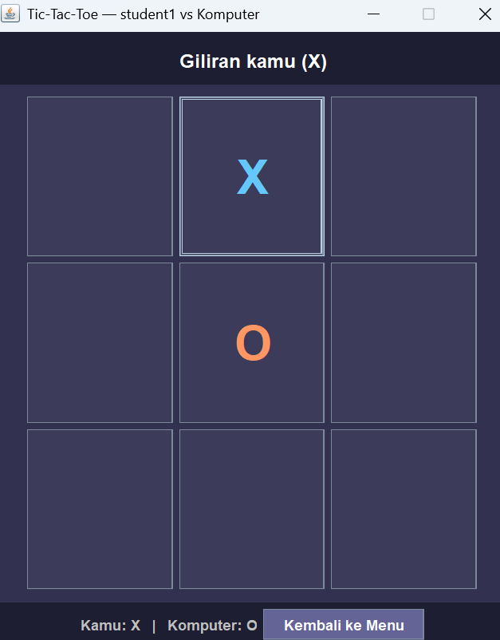
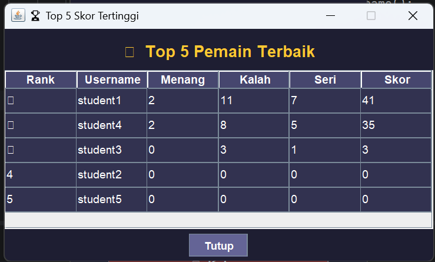

# Simple Tic-Tac-Toe Game with Java Swing, Login, and Statistics

## Student Information
Name       : Kezia Davina Hagata Barus
Student ID : 5026251222
Class      : A

## Description
Aplikasi game Tic-Tac-Toe sederhana menggunakan Java Swing GUI.
Pemain melawan komputer. Dilengkapi fitur login, statistik personal,
dan top 5 skor dari database MySQL.

## Features
- Login menggunakan database MySQL
- Bermain Tic-Tac-Toe vs Komputer (Java Swing GUI)
- Statistik: wins, losses, draws, score
- Top 5 Scorers menggunakan JTable
- Navigasi antar window

## Score System
- WIN  : +10 poin
- DRAW : +3 poin
- LOSE : +0 poin

## Database
MySQL 

## How to Run
1. Install MySQL, buat database dengan schema di folder database
2. Buka project di IntelliJ IDEA
3. Tambahkan mysql-connector-j.jar ke Libraries
4. Edit DatabaseManager.java (isi password MySQL)
5. Run Main.java

## Class Explanation
- Main            : Entry point, membuka LoginFrame
- DatabaseManager : Koneksi JDBC ke MySQL
- Player          : Model data pemain
- PlayerService   : Login, update statistik, top 5
- GameLogic       : Logika game (move, winner, draw, AI)
- LoginFrame      : Window login
- MainMenuFrame   : Window menu utama
- GameFrame       : Window permainan
- StatisticsFrame : Window statistik personal
- TopScorersFrame : Window top 5 skor (JTable)

## YouTube
(https://youtu.be/axxsjhXnenA?feature=shared)

## GitHub
https://github.com/kezia17-imup/TicTacToeGames

## Screenshoots
### Login Window

### Game Window

### Top 5 Scorers Window

